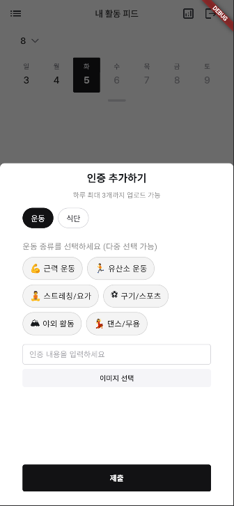
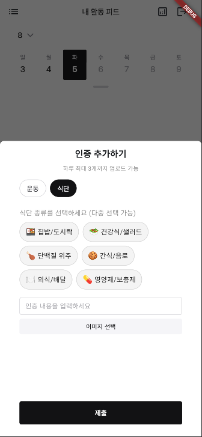
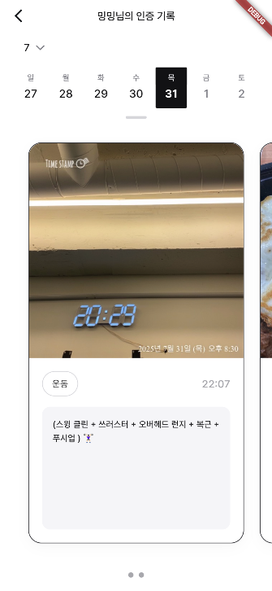
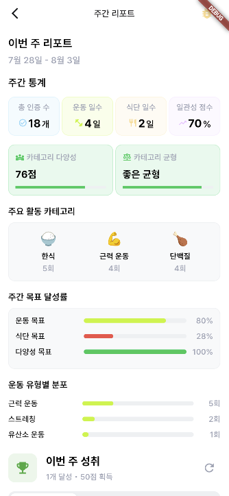
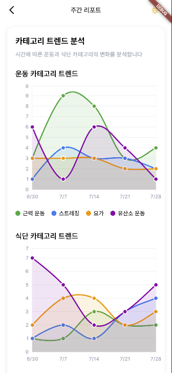
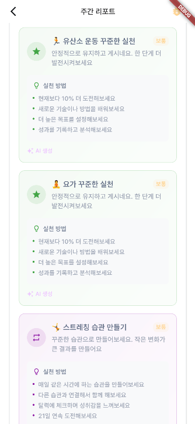
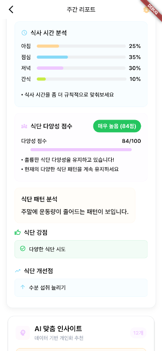
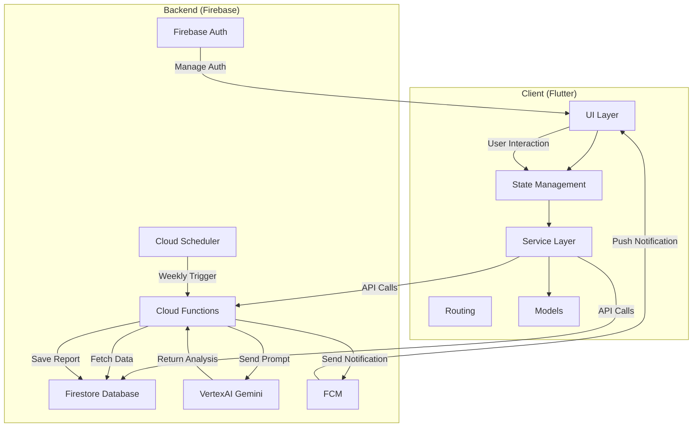

# 하루 체크 (Seol Haru Check)

> AI와 함께 매일의 건강을 기록하고, 매주 똑똑한 리포트를 받아보세요.

"하루 체크"는 사용자의 운동 및 식단 기록을 AI가 분석하여 매주 개인화된 건강 리포트를 제공하는 Flutter 애플리케이션입니다. 단순한 기록을 넘어, 데이터 시각화와 추세 분석을 통해 사용자가 자신의 건강 상태를 직관적으로 이해하고 지속 가능한 건강 습관을 형성하도록 돕습니다.

## 📱 앱 스크린샷 (App Screenshots)

<div align="center">

### 📝 일일 인증 기록
 

### 📅 인증 기록 조회 및 상세보기
 

### 🤖 AI 주간 리포트
     

</div>

## ✨ 주요 기능 (Key Features)

*   **📱 일일 인증 기록**: 사용자가 운동과 식단 활동을 사진과 함께 기록하고 인증할 수 있습니다.
*   **📅 캘린더 기반 추적**: 달력 인터페이스를 통해 날짜별 인증 기록을 직관적으로 확인할 수 있습니다.
*   **👥 소셜 피드**: 개인 활동 피드와 다른 사용자들의 인증 기록을 확인할 수 있습니다.
*   **🤖 AI 주간 리포트**: Google VertexAI (Gemini)를 활용하여 매주 사용자의 운동/식단 데이터를 심층 분석하고, 강점과 개선점을 포함한 맞춤형 리포트를 생성합니다.
*   **📊 인터랙티브 데이터 시각화**: `fl_chart`를 기반으로 구축된 자체 차트 모듈을 통해 활동 빈도, 카테고리 분포, 영양 균형 등 복잡한 데이터를 직관적인 차트로 시각화합니다.
*   **⚙️ 체계적인 상태 관리**: Riverpod를 활용하여 로딩, 생성, 에러, 타임아웃 등 상세한 UI 상태를 관리하여 사용자에게 안정적이고 부드러운 경험을 제공합니다.
*   **📈 과거 기록 조회 및 비교**: 과거 리포트를 손쉽게 조회하고, 주간 데이터 비교를 통해 자신의 성장 과정을 추적할 수 있습니다.
*   **✈️ 오프라인 지원**: 네트워크 연결이 없는 환경에서도 캐시된 데이터를 통해 앱의 핵심 기능을 사용할 수 있습니다.
*   **🔔 실시간 업데이트 및 알림**: Firebase를 통해 데이터 변경을 실시간으로 감지하고, 리포트가 생성되면 푸시 알림으로 알려줍니다.
*   **🔐 간편 인증**: 닉네임과 4자리 비밀번호를 통한 간단한 사용자 인증 시스템

## 🏗️ 아키텍처 (Architecture)

이 프로젝트는 Flutter 프론트엔드와 Firebase 서버리스 백엔드로 구성된 확장 가능하고 유지보수가 용이한 아키텍처를 채택했습니다.



*   **Frontend (Flutter)**:
    *   **상태 관리**: `Riverpod` (`StateNotifierProvider`, `StreamProvider`)
    *   **라우팅**: `GoRouter`
    *   **UI**: `fl_chart` 기반의 커스텀 차트 시스템
    *   **구조**: 관심사 분리 원칙에 따른 체계적인 폴더 구조
*   **Backend (Firebase Serverless)**:
    *   **인증**: Firebase Authentication
    *   **데이터베이스**: Firestore
    *   **스토리지**: Firebase Storage (이미지 저장)
    *   **서버 로직**: Cloud Functions (TypeScript)
    *   **자동화**: Cloud Scheduler
    *   **AI**: Google VertexAI (Gemini Pro)
    *   **알림**: Firebase Cloud Messaging
    *   **호스팅**: Firebase Hosting

## 📦 주요 의존성 (Key Dependencies)

### Core Framework
*   **Flutter SDK**: ^3.7.2 - 크로스 플랫폼 모바일/웹 개발
*   **Dart**: 주요 프로그래밍 언어

### Firebase & Backend
*   **firebase_core**: ^3.13.0 - Firebase 핵심 기능
*   **cloud_firestore**: ^5.6.7 - NoSQL 데이터베이스
*   **firebase_storage**: ^12.4.5 - 이미지 스토리지
*   **firebase_auth**: ^5.6.0 - 사용자 인증
*   **firebase_messaging**: ^15.1.6 - 푸시 알림

### State Management & Navigation
*   **flutter_riverpod**: ^2.6.1 - 상태 관리 솔루션
*   **go_router**: ^15.1.2 - 선언적 라우팅

### UI & Media
*   **cached_network_image**: ^3.4.1 - 이미지 캐싱 및 로딩
*   **image_picker**: ^1.1.2 - 카메라/갤러리 이미지 선택
*   **flutter_image_compress**: ^2.4.0 - 이미지 압축
*   **carousel_slider**: ^5.0.0 - 이미지 캐러셀
*   **table_calendar**: ^3.2.0 - 캘린더 위젯
*   **fl_chart**: ^0.69.0 - 차트 및 데이터 시각화
*   **flutter_svg**: ^2.1.0 - SVG 지원

### Utilities
*   **intl**: ^0.20.2 - 국제화 (한국어 로케일)
*   **shared_preferences**: ^2.5.3 - 로컬 데이터 저장
*   **connectivity_plus**: ^6.0.5 - 네트워크 연결 상태 확인
*   **flutter_dotenv**: ^5.2.1 - 환경 변수 관리
*   **uuid**: ^4.5.1 / **ulid**: ^2.0.1 - 고유 식별자 생성

## 🚀 기술적 강점 (Technical Highlights)

*   **견고한 상태 관리**: `isLoading`, `isGenerating`, `isProcessing`, `hasTimedOut` 등 세분화된 로딩 상태를 정의하고, `LoadingStateManager`를 통해 UI에 일관된 피드백을 제공합니다.
*   **지능형 캐싱 전략**: `OfflineManager`를 통한 영구 캐시와 `WeeklyReportService`의 인메모리 캐시를 결합한 이중 캐싱으로 온라인에서는 빠른 속도를, 오프라인에서는 끊김 없는 사용성을 보장합니다.
*   **모듈식 차트 시스템**: `BaseChartWidget`과 `ChartErrorHandler`를 통해 모든 차트의 공통 로직(테마, 애니메이션, 에러 핸들링)을 추상화하여 재사용성과 안정성을 높였습니다.
*   **관심사 분리 (SoC)**: UI(Page), 상태 로직(Provider), 비즈니스 로직(Service), 데이터 모델(Model)을 명확히 분리하여 코드의 가독성과 유지보수성을 극대화했습니다.
*   **체계적인 에러 핸들링**: `ErrorHandler`와 `AppException`을 통해 앱 전반의 예외를 중앙에서 관리하고, 사용자에게 명확한 피드백과 재시도 옵션을 제공합니다.

## 🏛️ 현재 아키텍처 패턴 (Current Architecture Patterns)

### 상태 관리 구조
*   **CertificationProvider**: 인증 기록 관리 (`StateNotifier` 기반)
*   **WeeklyReportProvider**: 주간 리포트 및 AI 분석 관리
*   **FeedProvider**: 피드 데이터 관리
*   **FCMProvider**: 푸시 알림 관리

### 서비스 레이어
*   **WeeklyReportService**: 주간 리포트 Firestore 연동
*   **FCMService**: Firebase Cloud Messaging 처리
*   **CategoryAchievementService**: 카테고리별 성취도 분석
*   **VisualizationDataService**: 데이터 시각화 처리
*   **OfflineManager**: 오프라인 캐싱 및 동기화

### 핵심 유틸리티
*   **ErrorHandler**: 중앙화된 에러 처리 (`lib/core/error_handler.dart`)
*   **OfflineManager**: 오프라인 지원 및 캐싱 (`lib/core/offline_manager.dart`)
*   **PersistentStorage**: 로컬 데이터 저장 (`lib/core/persistent_storage.dart`)

### 모델 구조
*   **CertificationModel**: 인증 기록 데이터 모델
*   **WeeklyReportModel**: 주간 리포트 및 AI 분석 데이터
*   **AchievementModels**: 성취도 및 진행률 모델
*   **ChartConfigModels**: 차트 설정 및 시각화 모델

## 📂 프로젝트 구조 (Project Structure)

```
seol_haru_check/
├── lib/
│   ├── constants/        # 앱 전체 상수 (문자열 등)
│   ├── core/             # 에러 핸들링, 오프라인 관리 등 핵심 로직
│   ├── enums/            # 타입 정의 (인증 타입, 셀 상태 등)
│   ├── extensions/       # Dart 확장 기능
│   ├── helpers/          # 유틸리티 헬퍼 함수
│   ├── models/           # 데이터 모델 (인증, 주간 리포트 등)
│   ├── pages/            # 화면(페이지) 위젯
│   ├── providers/        # Riverpod 상태 관리
│   ├── services/         # 외부 서비스 통신 (Firestore, AI, FCM 등)
│   ├── shared/           # 공통 컴포넌트, 색상, 테마 등
│   └── widgets/          # 재사용 가능한 위젯
├── assets/
│   ├── env/              # 환경 변수 파일 (.dev.env)
│   ├── fonts/pretendard/ # Pretendard 폰트 패밀리 (9가지 웨이트)
│   ├── icons/            # 체계적인 SVG 아이콘 시스템
│   │   ├── chevrons/     # 방향 아이콘
│   │   ├── emoji/        # 이모지 스타일 아이콘
│   │   ├── empty/        # 빈 상태 아이콘
│   │   ├── normal/       # 일반 아이콘
│   │   ├── palette/      # 그리기/편집 아이콘
│   │   ├── player/       # 미디어 플레이어 아이콘
│   │   ├── sns/          # 소셜 미디어 아이콘
│   │   └── tab_bar/      # 네비게이션 아이콘
│   ├── images/           # 정적 이미지 및 일러스트
│   ├── keys/             # Firebase 서비스 계정 키
│   └── svg/              # 추가 SVG 에셋
├── functions/            # Firebase Cloud Functions 소스 코드
└── web/                  # 웹 배포용 파일
```

## 📋 핵심 비즈니스 규칙 (Core Business Rules)

*   **일일 인증 제한**: 사용자당 하루 최대 3개의 인증 기록 가능
*   **인증 타입**: 운동(Exercise)과 식단(Diet) 두 가지 카테고리
*   **필수 사진 업로드**: 모든 인증에는 사진 첨부 필수
*   **한국어 인터페이스**: 한국 로케일(`ko_KR`) 기반 날짜 형식 및 UI
*   **주간 리포트**: 매주 AI가 생성하는 개인화된 건강 분석 리포트
*   **실시간 동기화**: Firebase를 통한 실시간 데이터 동기화

## 👤 사용자 플로우 (User Flow)

1. **로그인**: 닉네임과 4자리 비밀번호로 간편 로그인
2. **일일 인증**: 운동/식단 활동을 사진과 함께 기록
3. **피드 확인**: 개인 피드 및 다른 사용자들의 활동 조회
4. **캘린더 추적**: 달력을 통한 날짜별 인증 기록 확인
5. **주간 리포트**: AI가 생성한 개인화된 건강 분석 리포트 확인
6. **알림 관리**: 푸시 알림 및 알림 기록 확인
7. **관리자 추적**: 관리자는 모든 참가자의 활동을 모니터링 가능

## 📱 현재 구현된 페이지 (Implemented Pages)

*   **로그인 페이지** (`LoginPage`): 닉네임/비밀번호 기반 인증
*   **내 피드 페이지** (`MyFeedPage`): 개인 활동 피드 및 캘린더 뷰
*   **다른 사용자 피드** (`OtherUserFeedPage`): 다른 참가자의 활동 조회
*   **주간 리포트 페이지** (`WeeklyReportPage`): AI 분석 리포트 및 데이터 시각화
*   **알림 기록 페이지** (`NotificationHistoryPage`): 푸시 알림 기록 관리
*   **참여자 인증 페이지** (`CertificationTrackerPage`): 전체 참가자 모니터링

## 🏁 시작하기 (Getting Started)

### Prerequisites

*   Flutter SDK (^3.7.2)
*   Firebase CLI
*   Firebase 프로젝트 및 설정 (`google-services.json`, `GoogleService-Info.plist`)
*   Node.js (Cloud Functions 개발용)

### Installation & Run

1.  **Firebase 프로젝트 설정**:
    ```bash
    # Firebase 프로젝트 생성 및 설정
    firebase init
    ```
    *   Firestore, Firebase Authentication, Cloud Functions, Cloud Messaging, Hosting을 활성화합니다.
    *   `android/app/google-services.json` 및 `ios/Runner/GoogleService-Info.plist` 파일을 추가합니다.

2.  **환경 변수 설정**:
    ```bash
    # assets/env/.dev.env 파일 생성 및 필요한 환경 변수 설정
    cp assets/env/.dev.env.example assets/env/.dev.env
    ```

3.  **Flutter 종속성 설치**:
    ```bash
    flutter pub get
    ```

4.  **Cloud Functions 설정** (선택사항):
    ```bash
    cd functions
    npm install
    ```

5.  **앱 실행**:
    ```bash
    # 개발 모드
    flutter run
    
    # 웹 브라우저에서 실행
    flutter run -d chrome
    
    # 릴리즈 모드
    flutter run --release
    ```

### 배포 (Deployment)

```bash
# 웹 빌드 및 Firebase 호스팅 배포
flutter build web
firebase deploy --only hosting

# Cloud Functions 배포
firebase deploy --only functions

# 전체 Firebase 프로젝트 배포
firebase deploy
```

## 🛠️ 개발 도구 및 디버깅 (Development Tools & Debugging)

### 디버그 모드
프로젝트에는 개발 및 테스트를 위한 디버그 기능이 포함되어 있습니다:

*   **DEBUG_MODE_GUIDE.md**: 디버그 모드 사용 가이드
*   **Debug Data Helper**: 테스트용 더미 데이터 생성 (`lib/helpers/debug_data_helper.dart`)
*   **로그 시스템**: 상세한 로깅을 통한 디버깅 지원

### 개발 환경 설정
```bash
# 개발 환경 변수 설정
cp assets/env/.dev.env.example assets/env/.dev.env

# 디버그 모드로 실행
flutter run --debug

# 프로파일 모드로 성능 테스트
flutter run --profile

# 웹 디버그 모드
flutter run -d chrome --debug
```

### 테스트
```bash
# 단위 테스트 실행
flutter test

# 통합 테스트 실행
flutter test integration_test/

# 코드 분석
flutter analyze

# Flutter 환경 확인
flutter doctor
```

## 📝 최근 업데이트 (Recent Updates)

### 2025년 8월 업데이트
*   ✅ **README 문서 정확성 개선**: 현재 코드베이스와 일치하도록 문서 업데이트
*   ✅ **에셋 활성화**: `pubspec.yaml`에서 주석 처리된 아이콘 및 이미지 에셋 활성화
*   ✅ **환경 변수 템플릿**: `.dev.env.example` 파일 추가로 개발 환경 설정 가이드 제공
*   ✅ **프로젝트 구조 문서화**: 실제 구현된 폴더 구조 및 파일 반영
*   ✅ **기능 명세 정확화**: 현재 구현된 기능과 페이지 정보 업데이트
*   ✅ **개발 도구 가이드**: 디버깅 및 테스트 방법 추가

### 주요 개선사항
*   **정확한 의존성 정보**: 현재 사용 중인 패키지 버전 및 용도 명시
*   **실제 아키텍처 반영**: 구현된 Provider, Service, Model 구조 문서화
*   **개발자 친화적**: 환경 설정부터 배포까지 단계별 가이드 제공

---

**문의**: byeongheeoh51@gmail.c